> 🇬🇧 **English Version** | 🇧🇷 [Leia esta página em Português](README.md)

# 💰 Finance Management API

A RESTful API for personal finance management. This project was developed as a full-stack portfolio piece, focusing on back-end development best practices with the Spring ecosystem and front-end with Angular.

## 📖 About The Project

The goal of the Finance Management API is to provide a complete service where users can register, manage their transactions (income and expenses), create custom categories with budget goals, and view a dashboard summarizing their financial health.

## 🏛️ Architecture and Data Modeling

The application follows a decoupled architecture, containerized with Docker. The back-end exposes a RESTful API that is consumed by the front-end.

Below are the high-level diagrams that represent the project's architecture and data model.

### System Architecture

```mermaid
flowchart TB
    %% Main container style's
    subgraph Docker["🧱 **Docker Environment**"]
        %% Main nodes
        FE["🖥️ **Front-end application**<br/>(Angular)"]
        BE["⚙️ **Back-end application**<br/>(Spring Boot)"]
        DB["🗄️ **Database**<br/>(PostgreSQL)"]

        %% Links/Communication
        FE <--> |"🌐 HTTP Requests<br/>(API RESTful)<br/><br/>📦 JSON Responses"| BE
        BE --> |"🔗 Communication through JPA / JDBC"| DB
    end

    %% Optional styles
    classDef service fill:#E3F2FD,stroke:#1E88E5,stroke-width:1px,color:#0D47A1;
    classDef db fill:#E8F5E9,stroke:#2E7D32,stroke-width:1px,color:#1B5E20;
    classDef fe fill:#FFF3E0,stroke:#FB8C00,stroke-width:1px,color:#E65100;

    class FE fe;
    class BE service;
    class DB db;
```



### Entity-Relationship Diagram (ER Diagram)


> 📖 For a more detailed view of the code architecture, including the **UML Class Diagram**, please refer to the [detailed documentation in the `/docs` folder](docs/).

## ✨ Features

- [ ] User authentication and authorization system via JWT.
- [ ] Full CRUD for Transactions (Income and Expenses).
- [ ] Full CRUD for custom Categories (with color, icon, and monthly goal).
- [ ] Business logic for category deletion without transaction data loss.
- [ ] Dashboard with a monthly financial summary (total income, expenses, balance, and goal progress).
- [ ] Monthly financial summary emails sent via scheduled tasks (Spring Scheduler).
- [ ] Automatically generated and interactive API documentation with Swagger UI.

## 🛠️ Tech Stack

This application was built using the following technologies:

- **Language:** [Java 21](https://www.oracle.com/java/)
- **Main Framework:** [Spring Boot 3](https://spring.io/projects/spring-boot)
  - **Spring Web:** For building RESTful endpoints.
  - **Spring Data JPA:** For data persistence.
  - **Spring Security:** For implementing authentication and authorization.
- **Front-end:** [Angular](https://angular.io/)
- **Build Tool:** [Gradle (Kotlin DSL)](https://gradle.org/)
- **Authentication:** [JWT (jjwt)](https://github.com/jwtk/jjwt)
- **Database:**
  - [PostgreSQL](https://www.postgresql.org/): For development and production environments.
  - [Flyway](https://flywaydb.org/): For database schema version control.
- **Environment:** [Docker & Docker Compose](https://www.docker.com/)
- **Documentation:** [Springdoc OpenAPI (Swagger UI)](https://springdoc.org/)

## 🚀 Getting Started

To run this project locally, follow the steps below.

### Prerequisites

- Java (JDK) 21 or higher.
- Git.
- Docker and Docker Compose.

### Steps

1. **Clone the repository:**

    ```bash
    git clone [https://github.com/manojohnsons/finance-api.git](https://github.com/manojohnsons/finance-api.git)
    cd finance-api
    ```

2. **Start the Docker environment:**
    This command will spin up the PostgreSQL container, as defined in the `docker-compose.yml` file.

    ```bash
    docker-compose up -d
    ```

3. **Run the application:**
    The project uses the Gradle Wrapper, so you don't need to have Gradle installed on your machine.

    ```bash
    # On Linux or macOS systems
    ./gradlew bootRun

    # On Windows systems
    .\gradlew.bat bootRun
    ```

4. The API will be available at `http://localhost:8080`.

## 📚 API Documentation

Thanks to Springdoc OpenAPI, complete and interactive API documentation is automatically generated. After starting the application, you can access it at:

- **[http://localhost:8080/swagger-ui.html](http://localhost:8080/swagger-ui.html)**

On this page, you can view all available endpoints, their parameters, request/response formats, and even test the API directly from your browser.

## 📝 License

This project is under the MIT License. See the [LICENSE](LICENSE) file for more details.
