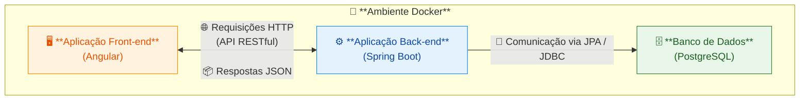
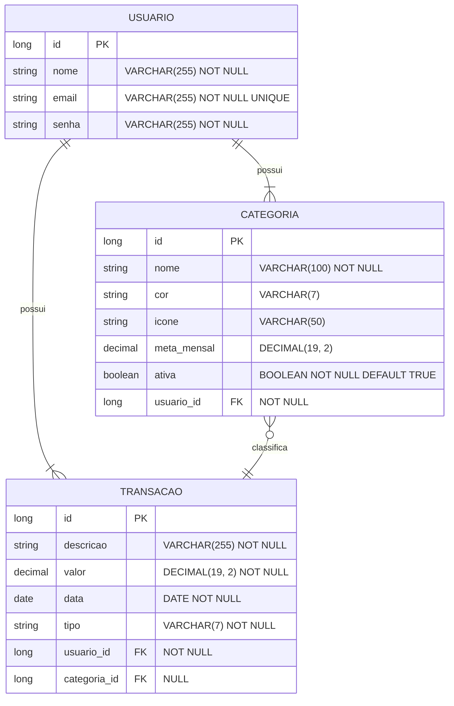

> 🇧🇷 **Versão em Português** | 🇬🇧 [Read this page in English](README-en.md)

# 💰 Finance Management API

API RESTful para gerenciamento de finanças pessoais. Este projeto foi desenvolvido como um projeto de portfólio full-stack, focando em boas práticas de desenvolvimento back-end com o ecossistema Spring e front-end com Angular.

## 📖 Sobre o Projeto

O objetivo da Finance Management API é fornecer um serviço completo onde usuários possam se cadastrar, gerenciar suas transações (receitas e despesas), criar categorias personalizadas com metas de orçamento e visualizar um dashboard com o resumo de sua saúde financeira.

## 🏛️ Arquitetura e Modelagem de Dados

A aplicação segue uma arquitetura de microsserviços desacoplada, conteinerizada com Docker. O back-end expõe uma API RESTful que é consumida pelo front-end.

Abaixo estão os diagramas de alto nível que representam a arquitetura e o modelo de dados do projeto.

### Arquitetura do Sistema



### Diagrama Entidade-Relacionamento (DER)



> 📖 Para uma visão mais detalhada da arquitetura do código, incluindo o **Diagrama de Classes UML**, por favor, consulte a [documentação detalhada na pasta `/docs`](docs/).

## ✨ Features

- [ ] Sistema de autenticação e autorização de usuários via JWT.
- [ ] CRUD completo para Transações (Receitas e Despesas).
- [ ] CRUD completo para Categorias personalizadas (com cor, ícone e meta mensal).
- [ ] Lógica de negócio para exclusão de categorias sem perda de dados de transações.
- [ ] Dashboard com resumo financeiro mensal (total de receitas, despesas, saldo e progresso de metas).
- [ ] Envio de resumos financeiros mensais por e-mail via tarefas agendadas (Spring Scheduler).
- [ ] Documentação da API gerada automaticamente e interativa com Swagger UI.

## 🛠️ Tecnologias Utilizadas

Esta aplicação foi construída utilizando as seguintes tecnologias:

- **Linguagem:** [Java 21](https://www.oracle.com/java/)
- **Framework Principal:** [Spring Boot 3](https://spring.io/projects/spring-boot)
  - **Spring Web:** Para a construção de endpoints RESTful.
  - **Spring Data JPA:** Para a persistência de dados.
  - **Spring Security:** Para a implementação da autenticação e autorização.
- **Front-end:** [Angular](https://angular.io/)
- **Build Tool:** [Gradle (Kotlin DSL)](https://gradle.org/)
- **Autenticação:** [JWT (jjwt)](https://github.com/jwtk/jjwt)
- **Banco de Dados:**
  - [PostgreSQL](https://www.postgresql.org/): Para ambiente de desenvolvimento e produção.
  - [Flyway](https://flywaydb.org/): Para controle de versão do schema do banco de dados.
- **Ambiente:** [Docker & Docker Compose](https://www.docker.com/)
- **Documentação:** [Springdoc OpenAPI (Swagger UI)](https://springdoc.org/)

## 🚀 Como Executar o Projeto

Para executar este projeto localmente, siga os passos abaixo.

### Pré-requisitos

- Java (JDK) 21 ou superior.
- Git.
- Docker e Docker Compose.

### Passos

1. **Clone o repositório:**

    ```bash
    git clone [https://github.com/manojohnsons/finance-api.git](https://github.com/manojohnsons/finance-api.git)
    cd finance-api
    ```

2. **Inicie o ambiente Docker:**
    Este comando irá subir o container do PostgreSQL, conforme definido no arquivo `docker-compose.yml`.

    ```bash
    docker-compose up -d
    ```

3. **Execute a aplicação:**
    O projeto utiliza o Gradle Wrapper, então você não precisa ter o Gradle instalado na sua máquina.

    ```bash
    # Em sistemas Linux ou macOS
    ./gradlew bootRun

    # Em sistemas Windows
    .\gradlew.bat bootRun
    ```

4. A API estará disponível em `http://localhost:8080`.

## 📚 Documentação da API

Graças ao Springdoc OpenAPI, a documentação completa e interativa da API é gerada automaticamente. Após iniciar a aplicação, você pode acessá-la em:

- **[http://localhost:8080/swagger-ui.html](http://localhost:8080/swagger-ui.html)**

Nesta página, você poderá ver todos os endpoints disponíveis, seus parâmetros, os formatos de requisição/resposta e até mesmo testar a API diretamente do seu navegador.

## 📝 Licença

Este projeto está sob a licença MIT. Veja o arquivo [LICENSE](LICENSE) para mais detalhes.
