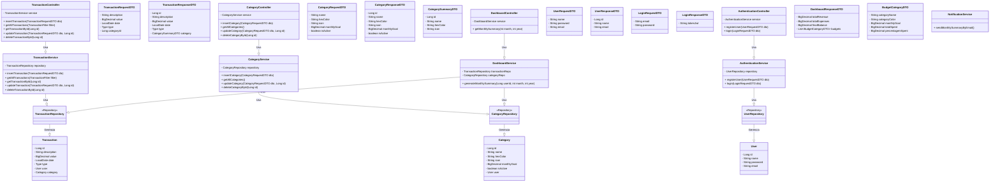

# Diagrama de Classes do Projeto (UML)

```mermaid
classDiagram
    TransactionController --|> TransactionService : Usa
    TransactionService --|> TransactionRepository : Usa
    TransactionRepository --|> Transaction : Gerencia
    class TransactionController {
        %% Anotação @RestController
        - TransactionService service
        + insertTransaction(TransactionRequestDTO dto)
        + getAllTransactions(TransactionFilter filter)
        + getTransactionById(Long id)
        + updateTransaction(TransactionRequestDTO dto, Long id)
        + deleteTransactionById(Long id)
    }
    class TransactionService {
        %% Anotação @Service
        - TransactionRepository repository
        + insertTransaction(TransactionRequestDTO dto)
        + getAllTransactions(TransactionFilter filter)
        + getTransactionById(Long id)
        + updateTransaction(TrasactionRequestDTO dto, Long id)
        + deleteTransactionById(Long id)
    }
    class TransactionRepository {
        <<Repository>>
        %% Aqui haverá métodos do JPA, se houver necessidade de um método customizado, é só adicionar aqui.
    }
    class Transaction {
        %% Anotação @Entity
        - Long id
        - String description
        - BigDecimal value
        - LocalDate date
        %% Type ("DESPESA" ou "RECEITA" será um enum)
        - Type type
        - User user
        - Category category
    }
    class TransactionRequestDTO {
        - String description
        - BigDecimal value
        - LocalDate date
        - Type type
        - Long categoryId
    }
    class TransactionResponseDTO {
        - Long id
        - String description
        - BigDecimal value
        - LocalDate date
        - Type type
        - CategorySummaryDTO category
    }

    CategoryController --|> CategoryService : Usa
    CategoryService --|> CategoryRepository : Usa
    CategoryRepository --|> Category : Gerencia
    class CategoryController {
        %% Anotação @RestController
        - CategoryService service
        + insertCategory(CategoryRequestDTO dto)
        + getAllCategories()
        + updateCategory(CategoryRequestDTO dto, Long id)
        + deleteCategoryById(Long id)
    }
    class CategoryService {
        %% Anotação @Service
        - CategoryRepository repository
        + insertCategory(CategoryRequestDTO dto)
        + getAllCategories()
        + updateCategory(CategoryRequestDTO dto, Long id)
        + deleteCategoryById(Long id)
    }
    class CategoryRepository {
        <<Repository>>
        %% Aqui haverá métodos do JPA, se houver necessidade de um método customizado, é só adicionar aqui.
    }
    class Category {
        %% Anotação @Entity
        - Long id
        - String name
        - String hexColor
        - String icon
        - BigDecimal monthlyGoal
        - boolean isActive
        - User user
    }
    class CategoryRequestDTO {
        - String name
        - String hexColor
        - String icon
        - BigDecimal monthlyGoal
        - boolean isActive
    }
    class CategoryResponseDTO {
        - Long id
        - String name
        - String hexColor
        - String icon
        - BigDecimal monthlyGoal
        - boolean isActive
    }
    class CategorySummaryDTO {
        - Long id
        - String name
        - String hexColor
        - String icon
    }

    AuthenticationController --|> AuthenticationService : Usa
    AuthenticationService --|> UserRepository : Usa
    UserRepository --|> User : Gerencia
    class AuthenticationController {
        %% Anotação @RestController
        - AuthenticationService service
        + registerUser(UserRequestDTO dto)
        + login(LoginRequestDTO dto)
    }
    class AuthenticationService {
        %% Anotação @Service
        - UserRepository repository
        + registerUser(UserRequestDTO dto)
        + login(LoginRequestDTO dto)
    }
    class UserRepository {
        <<Repository>>
        %% Aqui haverá métodos do JPA, se houver necessidade de um método customizado, é só adicionar aqui.
    }
    class User {
        %% Anotação @Entity
        - Long id
        - String name
        - String password
        - String email
    }
    class UserRequestDTO {
        - String name
        - String password
        - String email
    }
    class UserResponseDTO {
        - Long id
        - String name
        - String email
    }
    class LoginRequestDTO {
        - String email
        - String password
    }
    class LoginResponseDTO {
        - String tokenJwt
    }

    DashboardController --|> DashboardService : Usa
    DashboardService --|> TransactionRepository : Usa
    DashboardService --|> CategoryRepository : Usa
    class DashboardController {
        %% Anotação @RestController
        - DashboardService service
        + getMonthlySummary(int month, int year)
    }
    class DashboardService {
        %% Anotação @Service
        - TransactionRepository transactionRepo
        - CategoryRepository categoryRepo
        + generateMonthlySummary(Long userId, int month, int year)
    }
    class DashboardResponseDTO {
        - BigDecimal totalRevenue
        - BigDecimal totalExpenses
        - BigDecimal finalBalance
        - List~BudgetCategoryDTO~ budgets
    }
    class BudgetCategoryDTO {
        - String categoryName
        - String categoryColor
        - BigDecimal monthlyGoal
        - BigDecimal totalSpent
        - BigDecimal percentagemSpent
    }

    class NotificationService {
        %% Anotação @Service
        + sendMonthlySummaryByEmail()
    }
```
